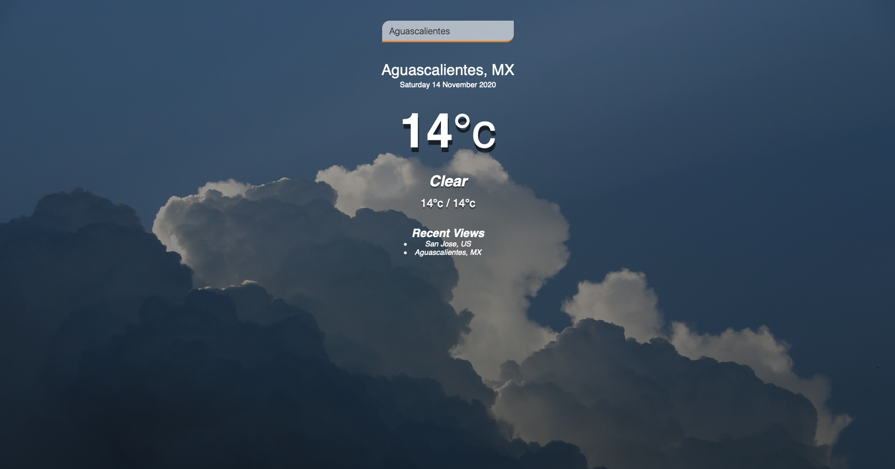

User Story:

AS A traveler
I WANT to see the weather outlook for multiple cities
SO THAT I can plan a trip accordingly

When User searches for a city and clicks enter the application will get the information about the Name, date, weather, and will be displayed,
The information is been retrieved from the API home.openweathermap

Work based from Tyler Potts.

URL for GitHub pages: https://luiscontrerasglz.github.io/WEATHERAPP_JS/
